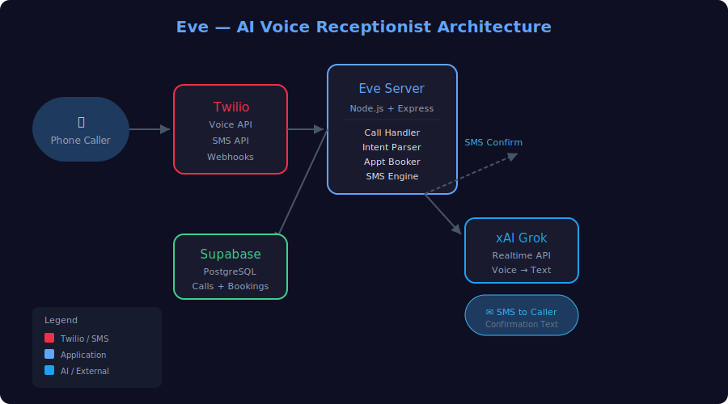

<h1 align="center">📞 Eve — AI Voice Receptionist</h1>
<p align="center">
  <b>24/7 AI Voice Agent Built on Twilio + xAI Realtime API</b>
</p>

<p align="center">
  
  
  
  
  
  
  
</p>

---

## 📋 The Problem

Small businesses miss calls. Every missed call is a potential lost customer. Hiring a human receptionist costs $30K+/year and only covers business hours. Voicemail feels impersonal and doesn't convert.

## 💡 The Solution

Eve answers every call, every time — 24/7/365. She handles the full intake conversation naturally: asks qualifying questions, answers common questions, books appointments, and sends SMS confirmations. No hold music, no phone trees, no missed opportunities.

---

## ✨ Key Features

| Feature | Description |
|---------|-------------|
| **Natural Conversation** | Powered by xAI Grok's Realtime API — speaks naturally, understands context, handles interruptions |
| **24/7 Availability** | Answers every call, never misses, never sleeps |
| **Appointment Booking** | Ask qualifying questions, check availability, book appointments directly into the calendar |
| **SMS Confirmations** | Auto-sends confirmation text after booking — includes date, time, location |
| **Intake Automation** | Captures caller name, phone, email, and reason for calling — structured data ready for CRM |
| **Customizable Script** | Adjustable tone, questions, and responses per business |
| **Real-time Transcription** | Full call transcript logged for review and quality assurance |

## 🧱 Architecturenn

```
┌──────────┐     ┌───────────┐     ┌──────────────┐
│  Phone   │────▶│  Twilio   │────▶│  Eve Server  │
│  Caller  │     │  Voice    │     │  (Node.js)   │
└──────────┘     └───────────┘     └──────┬───────┘
                                          │
                    ┌─────────────────────┼─────────────────────┐
                    │                     │                     │
            ┌───────▼──────┐    ┌─────────▼──────┐    ┌────────▼───────┐
            │  xAI Grok    │    │  Supabase      │    │  Twilio SMS    │
            │  Realtime    │    │  (Calls+Books) │    │  (Confirm)     │
            └──────────────┘    └────────────────┘    └────────────────┘
```

## 🛠 Tech Stack

- **Voice Infrastructure:** Twilio Voice API
- **AI Engine:** xAI Grok Realtime API
- **Backend:** Node.js + Express
- **Database:** Supabase (PostgreSQL)
- **SMS:** Twilio Messaging API
- **Scheduling:** Google Calendar API
- **Deployment:** DigitalOcean VPS

## 🚀 Status

**🟡 Prototype** — core conversation flow and appointment booking working. Ready for production deployment.

## 🎥 Demo

*[Link to Loom video — coming soon]*

---

## 🏁 Getting Started

```bash
git clone https://github.com/terryhuangjr-lgtm/eve-voice-agent.git
cd eve-voice-agent

npm install

# Configure your environment
cp .env.example .env
# Add: Twilio credentials, xAI API key, Supabase URL, Google Calendar creds

npm start
```
